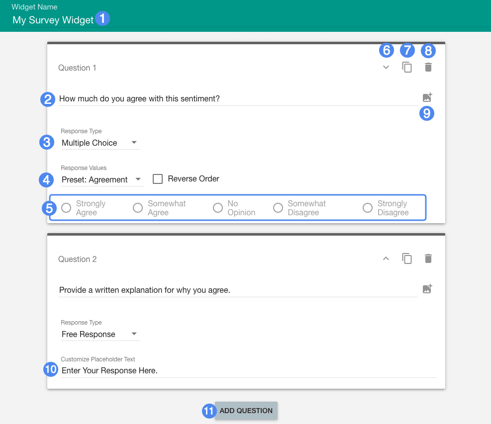
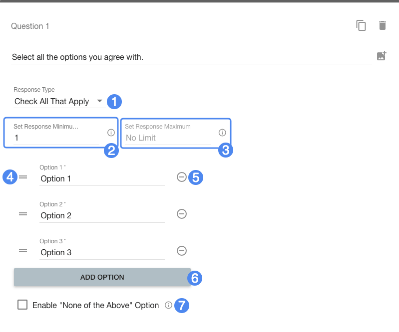
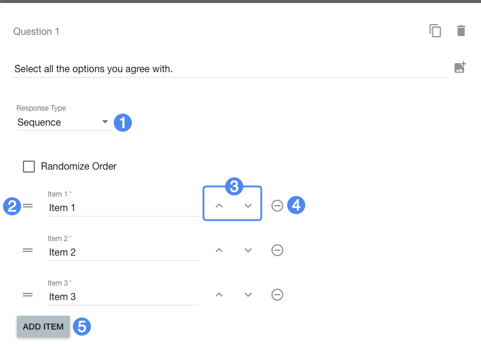

# Creator Guide #

## Overview ##

Create straightforward surveys with a variety of question types: multiple choice, check-all-that-apply, free response, or a "sequence" of ranked choices. Students are required to answer all questions before submission. The submission will not be scored.

1. Title of widget
2. Question text
3. Response type selection
4. Response value selection (only available with certain question types)
5. Preset response values (only visible with certain question and response types)
6. Change question ordering
7. Make a duplicate of this question
8. Remove this question
9. Add media to this question
10. Free response input placeholder text (only available with certain question types)
11. Add a question

## Details ##

Simple survey allows you to create linear questionnaires or surveys. The result will not be scored. Students can answer questions in any order, but are required to complete every question before submission. Every question type is allowed to have an optional image in addition to the question text.

Individual question options are specific to the response type selected:

### Multiple Choice ###

Students must select one of a set of provided responses. Choose between a number of presets under the **Response Values** drop-down, or select the **Custom** Response Value option to enter your own. You can choose between arranging responses in a horizontal row (with five response values or less), or a drop-down selection box.

### Check All That Apply ###

1. Response type selection
2. Minimum number of responses that must be checked
3. Maximum number of responses that can be checked (optional)
4. Drag the answer option to rearrange it
5. Remove this answer option
6. Add a new answer option
7. Enable "None of the above" option

With Check All That Apply questions, students are asked to select from a set of options. Unlike multiple choice, they can select more than one option, based on the minimum (2) and maximum values (3). There must always be a value for the minimum number of responses, but the maximum limit is optional.

The **None of the Above** option enables a "None of the above" choice with customizable text. When this choice is selected by a student, the other choices will automatically be deselected.

### Free Response ###

Free response questions provide a text area input with customizable placeholder text. The student may enter a word, phrase, or paragraph as a response to the question.

### Ranked Choice / "Sequence" ###

Sequence questions provide a list of choices and asks the student to rank them.

1. Response type selection
2. Drag the answer option to rearrange it
3. Move the answer option up and down to rearrange it
4. Remove this answer option
5. Add another answer option

Add answer choices the student can then rearrange to express their sequential preference. Use the **Randomize Order** option to randomly sort the answer options each time a student plays the widget.

