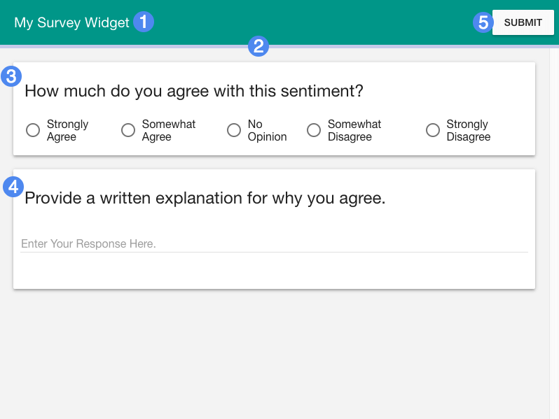
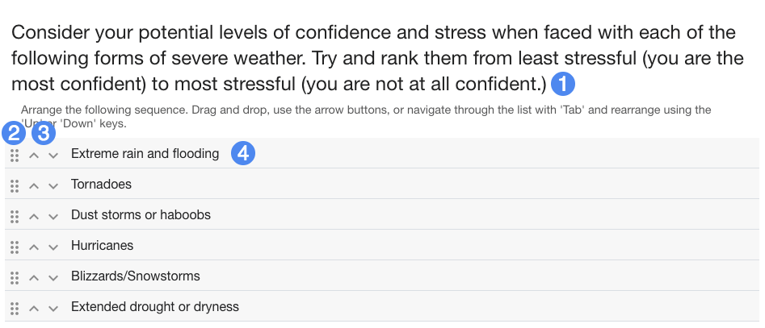

# Player Guide #

## Overview ##

In Simple Survey, students are asked to complete a linear survey or questionnaire. Questions can be answered in any order, but students must respond to all questions to complete the widget.

1. Title of widget
2. Completion bar
3. Survey question (multiple choice)
4. Survey question (free response)
5. Submit button

## Details ##

Survey questions come in one of four types: multiple choice, check-all-that-apply, free response, and ranked choice.

- For **Multiple Choice** questions students are asked to select one out of a range of answer options.
- For **Check All That Apply** questions, students are asked to select one or more answer options.
- For **Free Response** questions, students can provide a phrase, sentence, or paragraph in response to the question prompt.
- For **Ranked Choice** or "sequence" questions, students are asked to rank a set of answer choices in preferential order.

1. Ranked choice question text
2. Drag handle to rearrange answer item
3. Arrows to rearrange answer item
4. Answer item

In addition to dragging answer choices or using the arrows (3), students can also use the `tab` key in addition to the `up` and `down` arrow keys to rearrange the answer choices.